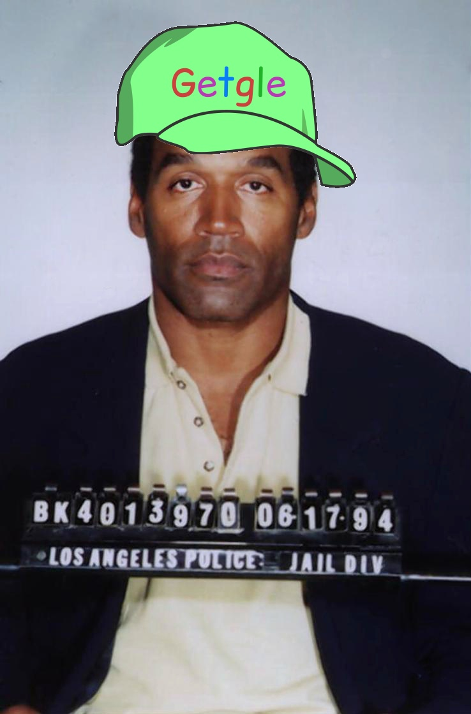
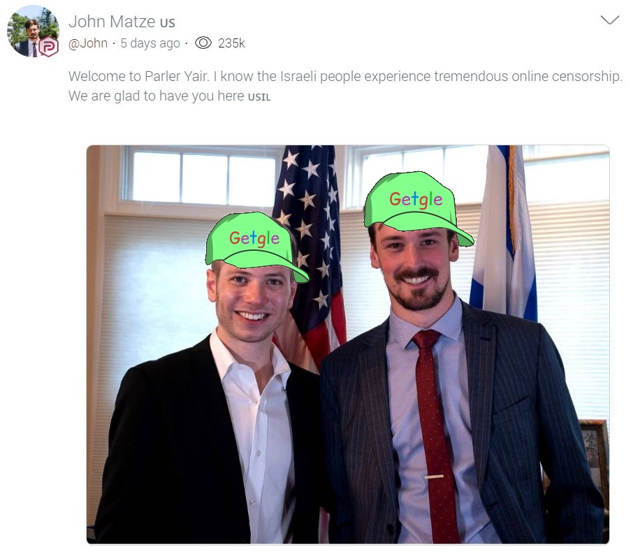
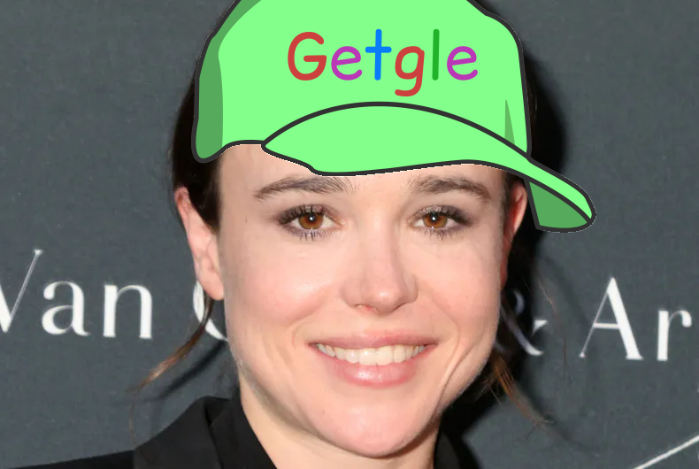
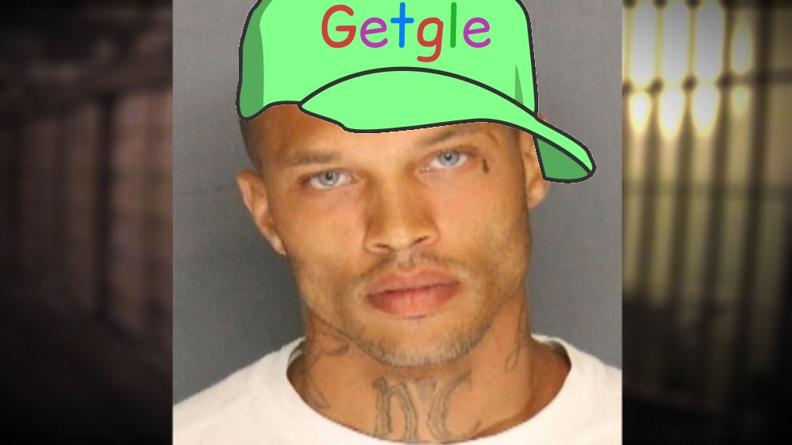

# AddGetgleHat

This script uses Python's OpenCV library to add a Getgle hat to every face it
finds in an image. It works best when the subjects in the image are facing the
camera directly, and works like dog shit in most other cases. It could use some
tweaks.

## Usage
This script is very easy to use.

1. Clone this repository.
2. Install libs: `python -m pip install -r requirements.txt`
3. Run the script: `./getglehat.py [input img] [output img]`

If you don't specify an input image, the script will run in webcam mode. It
will attempt to open your webcam and add images to faces in real time.

If no output image is specified, the script will just display the image without
saving it.

## Examples
Each of the following images were generated by this script:

